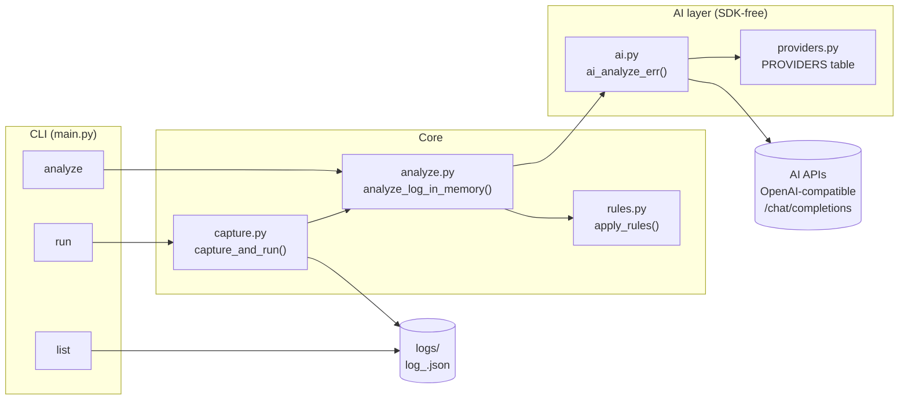
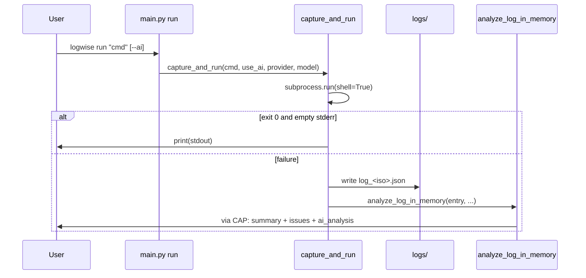
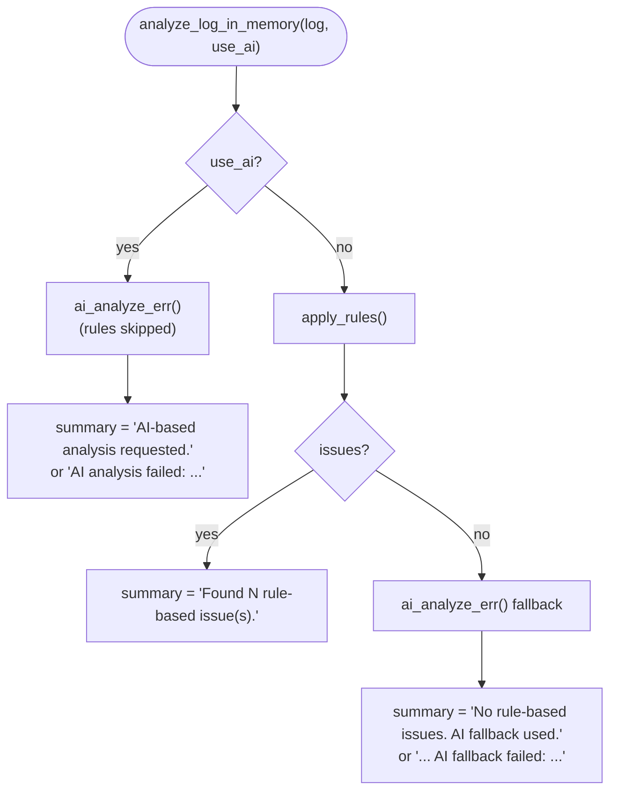
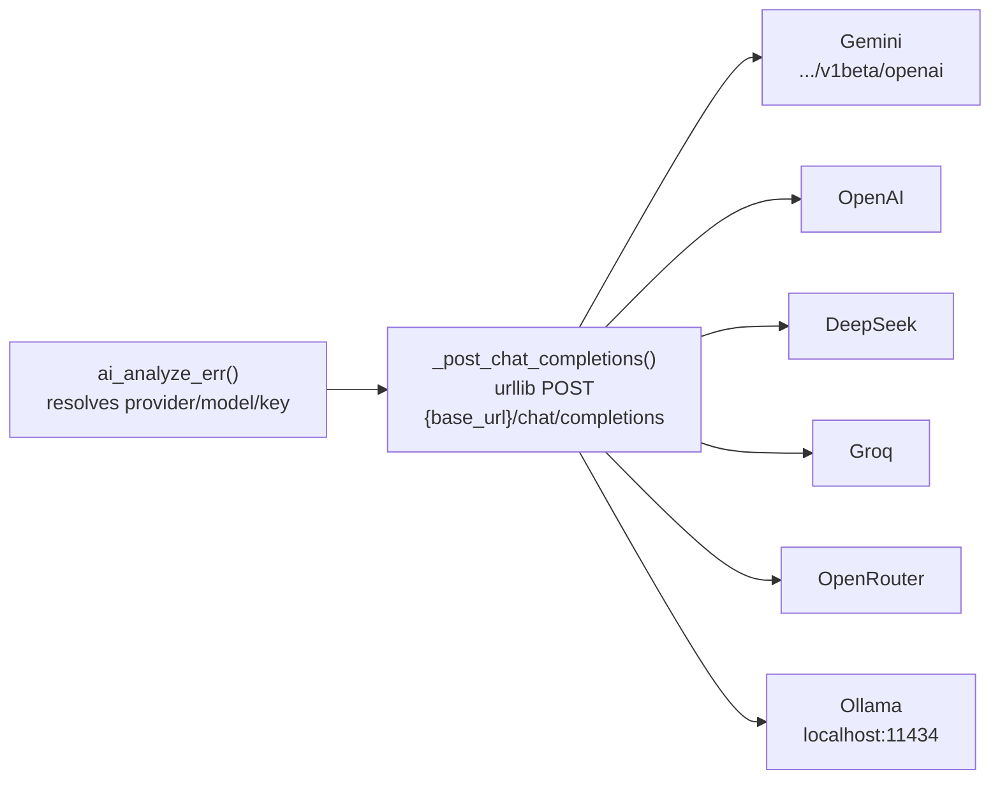
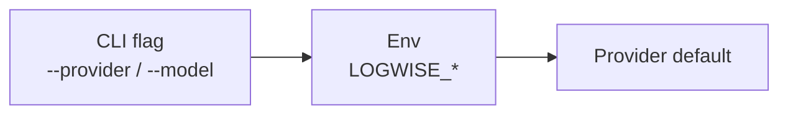

# LogWise

LogWise is a lightweight Python CLI that runs shell commands, saves failures as JSON logs, detects common failure patterns with built-in rules, and optionally asks an AI provider to explain the error and suggest fixes.

## Why LogWise?

When a command fails, the usual workflow is: rerun it, squint at the output, guess the root cause. LogWise shortens that loop by:

- running commands through a simple CLI,
- capturing stdout, stderr, exit codes, and timestamps,
- persisting every failure as a JSON log for later inspection,
- matching failures against built-in rules (missing files, permissions, …),
- suggesting practical fixes immediately,
- optionally consulting an AI provider — Gemini, OpenAI, DeepSeek, Groq, OpenRouter, or a local Ollama — through a single SDK-free HTTP layer.

## Features

- `run` — execute a command; print stdout on success, log + analyze on failure
- `analyze` — re-analyze any saved log file
- `list` — list saved logs
- Rule engine with extensible `ERROR_RULES`
- Multi-provider AI analysis over OpenAI-compatible APIs (stdlib `urllib` only, zero vendor SDKs)
- `uv`-managed project: locked deps, reproducible builds

## Requirements

- Python 3.10+ (`.python-version` pins 3.12)
- [`uv`](https://docs.astral.sh/uv/) for install/build (recommended)
- A terminal environment
- Optional: an API key for your AI provider (see [AI analysis](#ai-analysis)); `ollama` needs no key

## Installation

```bash
git clone https://github.com/dhanush-ballanki/logwise.git
cd logwise
uv sync          # create .venv, install locked deps + editable logwise
```

Run via `uv run`, or activate the venv (`.venv\Scripts\activate` on Windows, `source .venv/bin/activate` on Unix) and use `logwise` directly:

```bash
uv run logwise run "python script.py"
```

Build distributables (wheel + sdist into `dist/`):

```bash
uv build
```

Legacy pip setup still works, but `pyproject.toml` + `uv.lock` is canonical:

```bash
python -m venv .venv
pip install -e .
```

## Usage

### Run a command

```bash
logwise run "python script.py"
```

Success prints stdout only. Failure saves `logs/log_<timestamp>.json` and prints the analysis.

```bash
logwise run "python script.py" --ai --provider openai --model gpt-4o-mini
```

### Analyze an existing log

```bash
logwise analyze log_2025-04-06T10-30-00.json
logwise analyze log_2025-04-06T10-30-00.json --ai --provider groq
```

### List captured logs

```bash
logwise list
```

### Example

```bash
logwise run "ls /missing/path"
```

```text
Error occurred (exit code: 2)
Stderr captured:
ls: cannot access '/missing/path': No such file or directory

Analysis:
Found 2 rule-based issue(s).
- Reason: Command failed with non-zero exit code. (Possible reasons: Invalid arguments, missing dependencies, or runtime errors. Check stderr for details.)
  Steps to fix: Verify command syntax, install missing packages, or debug the script.
- Reason: File or directory not found. (Path issue.)
  Steps to fix: Check if the file exists (ls), correct the path, or create the missing item.
```

## Architecture

### System overview



**Module responsibilities:**

| Module | Role |
| --- | --- |
| `main.py` | Typer `app` with `run` / `analyze` / `list` commands; owns `--ai`, `--provider`, `--model` flags |
| `capture.py` | Runs the command via `subprocess.run(shell=True)`; writes the JSON log on failure; prints the analysis |
| `analyze.py` | `analyze_log_in_memory()` — the analysis orchestrator; `analyze_log()` loads a file then delegates; `list_logs()` lists `logs/` |
| `rules.py` | `ERROR_RULES` list + `apply_rules()`; new rules are plain dicts |
| `ai.py` | One `POST {base_url}/chat/completions` call via stdlib `urllib`; tolerant reason/fixes parsing |
| `providers.py` | `PROVIDERS` table (`base_url`, `key_env`, `default_model`) + `resolve_*()` helpers; adding a vendor is data-only |

`src/logwise/` has no `__init__.py` (namespace package).

### `logwise run` lifecycle



> Quirk: `returncode == 0` **with non-empty stderr** counts as failure and writes a log.

### Analysis decision flow



`--ai` is **AI-only** (rules skipped). Default mode runs rules first and calls AI only when zero rules match. AI errors are surfaced in `summary` — never silent, never a traceback.

### AI layer: one HTTP path, N providers



Request shape: `{model, messages: [{role: user, content: prompt}], temperature: 0.7, max_tokens: 700}`, with `Authorization: Bearer <key>` when the provider needs one. The response text is split into `reason` / `fixes` on the `step-by-step` marker (case-insensitive, tolerant of missing headers).

### Resolution precedence



| Setting | Flag | Env | Default |
| --- | --- | --- | --- |
| Provider | `--provider` | `LOGWISE_PROVIDER` | `gemini` |
| Model | `--model` | `LOGWISE_MODEL` | provider's `default_model` |
| Base URL | — | `LOGWISE_BASE_URL` | provider's `base_url` |
| API key | — | `LOGWISE_API_KEY` then provider key env | error unless keyless/localhost |

## Log format

Each failure is stored as `logs/log_<ISO-timestamp>.json` (`LOG_DIR` is `src/logwise/../../logs`, i.e. repo-root `logs/`, not configurable):

```json
{
    "command": "ls /missing/path",
    "start_time": "2026-09-20T06:49:37.422836",
    "end_time": "2026-09-20T06:49:37.435101",
    "stdout": "",
    "stderr": "ls: cannot access '/missing/path': No such file or directory",
    "exit_code": 2
}
```

And `analyze_log_in_memory()` returns:

```python
{
    "log": {...},                          # the entry above
    "issues": [...],                       # rule hits (default mode only)
    "summary": "Found 2 rule-based issue(s).",
    "ai_analysis": {                       # only on AI success
        "reason": "...", "fixes": "...",
        "provider": "groq", "model": "llama-3.3-70b-versatile",
    },
}
```

## Rule-based detection

`src/logwise/rules.py` currently ships three rules:

- `non_zero_exit` — exit code ≠ 0
- `permission_denied` — `permission denied` in stderr
- `file_not_found` — `no such file or directory` in stderr

Add a rule as a dict — no framework, no registration calls:

```python
{
    'id': 'module_not_found',
    'condition': lambda log: 'modulenotfounderror' in log['stderr'].lower().replace(' ', ''),
    'description': 'Python module not found.',
    'root_cause': 'Missing dependency.',
    'fixes': 'Install it with pip (pip install <package>).'
}
```

## AI analysis

When `--ai` is used, LogWise sends the command, exit code, and stderr to the selected provider and returns a concise reason plus fix steps.

Available providers (`--provider`, or `LOGWISE_PROVIDER` env, default `gemini`):

| Provider | Key env | Default model |
| --- | --- | --- |
| `gemini` | `GEMINI_API_KEY` | `gemini-2.0-flash` |
| `openai` | `OPENAI_API_KEY` | `gpt-4o-mini` |
| `deepseek` | `DEEPSEEK_API_KEY` | `deepseek-chat` |
| `groq` | `GROQ_API_KEY` | `llama-3.3-70b-versatile` |
| `openrouter` | `OPENROUTER_API_KEY` | `openai/gpt-4o-mini` |
| `ollama` | none (local) | `llama3.1` |

```bash
export GEMINI_API_KEY="your_key_here"   # or OPENAI_API_KEY / GROQ_API_KEY / ...
logwise run "python script.py" --ai
logwise run "python script.py" --ai --provider openai --model gpt-4o-mini
logwise analyze log_....json --ai --provider groq
ollama serve & logwise run "python script.py" --ai --provider ollama
```

Generic overrides for any OpenAI-compatible server: `LOGWISE_API_KEY`, `LOGWISE_MODEL`, `LOGWISE_BASE_URL`. There is no `.env` loader — export variables in your shell.

## Configuration reference

| Env var | Purpose | Default |
| --- | --- | --- |
| `LOGWISE_PROVIDER` | AI provider name | `gemini` |
| `LOGWISE_MODEL` | Model override | provider default |
| `LOGWISE_BASE_URL` | Custom OpenAI-compatible endpoint | provider default |
| `LOGWISE_API_KEY` | Generic key (beats provider-specific env) | — |
| `GEMINI_API_KEY` / `OPENAI_API_KEY` / `DEEPSEEK_API_KEY` / `GROQ_API_KEY` / `OPENROUTER_API_KEY` | Provider keys | — |

Flags beat env vars: `--provider` > `LOGWISE_PROVIDER`, `--model` > `LOGWISE_MODEL`.

## Project structure

```text
logwise/
├── AGENTS.md
├── LICENSE
├── README.md
├── pyproject.toml          # canonical deps + build config (setuptools, src layout)
├── uv.lock                 # locked deps (commit this)
├── .python-version         # pins 3.12
├── requirements.txt        # legacy — don't add new deps here
├── Pipfile / Pipfile.lock  # legacy — don't add new deps here
├── src/
│   └── logwise/
│       ├── ai.py           # SDK-free chat-completions client
│       ├── analyze.py      # analysis orchestrator
│       ├── capture.py      # subprocess runner + log writer
│       ├── main.py         # Typer CLI (run | analyze | list)
│       ├── providers.py    # provider registry
│       └── rules.py        # ERROR_RULES
├── logs/                   # created automatically when commands fail
├── dist/                   # uv build output (git-ignored)
└── .venv/                  # uv venv (git-ignored)
```

## Development

```bash
uv sync                  # install / refresh .venv from uv.lock
uv run logwise run "ls /missing/path"   # rules path
uv run logwise run "echo hi"            # success path
uv run logwise list
uv build                 # wheel + sdist into dist/
```

There is no test suite, linter, or CI yet — verify manually with a passing and a failing command as above. To exercise the AI layer without spending API calls, point `LOGWISE_BASE_URL` at any stub that answers `POST /chat/completions` with `{"choices": [{"message": {"content": "..."}}]}`.

## Contributing

Contributions are welcome:

1. Fork the repository
2. Create a feature branch
3. Make your changes (new rules go in `rules.py`, new vendors in `providers.py`)
4. Sanity-check with `uv run logwise run` on a failing + passing command
5. Submit a pull request

## License

This project is licensed under the MIT License. See the `LICENSE` file for details.

## Maintainer

Dhanush Ballanki
